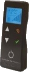

| :warning: WARNING          |
|:---------------------------|
| Currently in beta ...      |
|:---------------------------|
| This beta is working for me, waiting for your comments and remarks      |

# MQTT2Ravelli:
Add a way to drive Ravelli’s stove using MQTT with an Esp8266 plugged on to the serial port..

Add home automation on Ravelli's stoves that are using TOUCH remote control: 

This remote can be plugged on the stove, and this project is using the discussion protocole between the remote and the stove.
So with this project, you will be able to replace the remote control, to drive the stove and collect more details in real time.

# List of possible interaction with the stove:
## Action:
- Switch On or Off
- Send the room temperature (for stove power regulation)
- Send requested room temperature
- Send requested heat power (integer between 1 and 5)
- Send front fan power (integer between 0 and 6)
- Clean the fireplace

## Information:
- Stove status
- Current room temperature requested
- Current heat power requested
- Current front fan power
- Screw loading time
- Counter (partial, total, and number of start-ups)
- Temperature of exhaust gases
- Temperature of the electronic

# Known issues:
1. The ESP may not start when plugging in the board. Best is to switch off the stove, plug the board then switch on the sotve.
2. `ExhaustTemperature` return error message
3. `ElectronicTemperature` return incorrect temperature

# Schematic:

## BOM:
### Wire harness:
- 3x Contacts: SXH-002T-P0.6 from JST (XH Series, Socket, Crimp, 26 AWG, Tin Plated Contacts, JST XH Series Housings)
- 1x Housing: XHP-4 from JST (XH Series, Receptacle, 4 Positions, 2.5 mm, SXH Crimp Contacts)
- Wire: 22AWG / 0,326mm². JST recommends 26AWG / 0.129mm², but it's too thin, and the 22AWG is the wire size used by Ravelli.

### Board:
- 1x Diode (D1): 1N4148
- 1x Transistor (Q1): BC109
- 1x Resistance (R1): 10 kΩ
- 1x NAND gate: HCF4011BE, could be replace by a NOR GATE HCF4001BE (not tested yet)
- 1x ESP8266, Wemos D1 mini or NodeMCU (not tested yet)
- 1x 3 wire connector if on a proto board

# Not yet implemented:
- chrono thermostat
- date and time
- confort climate
- alarm list